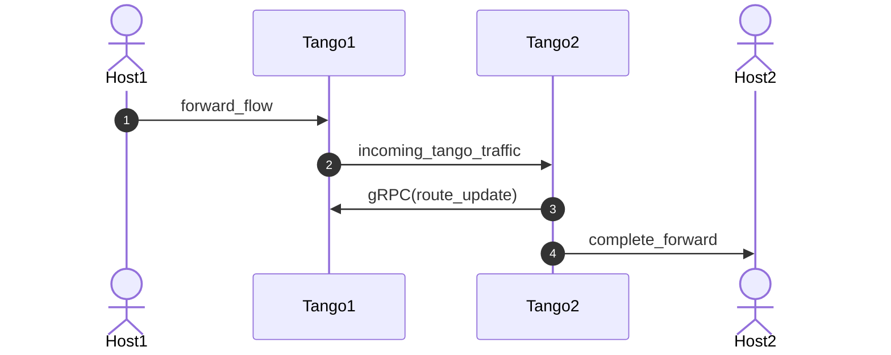

# Tango Packet Layout

- [Tango Packet Layout](#tango-packet-layout)
  - [Tango Peer-to-Peer Metrics Packet](#tango-peer-to-peer-metrics-packet)
    - [EthernetHeader\_t](#ethernetheader_t)
    - [IPv6Header\_t](#ipv6header_t)
    - [TangoHeader\_t](#tangoheader_t)
    - [IPv4Header\_t](#ipv4header_t)
    - [UDPHeader\_t](#udpheader_t)
  - [Lucid Event Flow Breakdown](#lucid-event-flow-breakdown)
    - [forward\_flow](#forward_flow)
    - [incoming\_tango\_traffic](#incoming_tango_traffic)
    - [route\_update](#route_update)
    - [complete\_forward](#complete_forward)
  - [Embedded Route Updates](#embedded-route-updates)

## Tango Peer-to-Peer Metrics Packet

On receive of an `IPv4/UDP` packet from an external client, a Tango node, *Tango1*, will encapsulate that packet with a `TangoHeader_t`, containing the sequence number, timestamp, and corresponding signatures, and an `IPv6Header_t` pertaining to the path that this packet should be tunneled through. This encapsulated packet is then sent to the peer node, *Tango2*.

The *Lucid* event of the tunnel packet is of the following form:

```lucid
event incoming_tango_traffic (
    EthernetHeader_t tango_eth_header,
    IPv6Header_t tango_ip_header,
    TangoHeader_t tango_metrics_header,
    IPv4Header_t encaped_ip_header,
    UDPHeader_t encaped_udp_header
);
```

### EthernetHeader_t

```lucid
type EthernetHeader_t = {
   int<<48>> dest_mac; 
   int<<48>> src_mac; 
   int<<16>> ethertype;
}
```

### IPv6Header_t

```lucid
type IPv6Header_t = {
   int<<32>>  version_cls_flow;
   int<<16>>  payload_len;
   int<<8>>   next_header;
   int<<8>>   hop_limit;
   int<<128>> src_addr;
   int<<128>> dest_addr;
}
```

### TangoHeader_t

```lucid
type TangoHeader_t = {
   int<<8>>   path_id;
   int<<16>>  timestamp;
   int<<32>>  signature;
   int<<16>>  sequence_num;
   int<<8>>   book_signature;
}
```

A note about this header: the sizes here are such that they make the packet byte-aligned. In actuality, `path_id` is 3-bit, `timestamp` is 12-bit, and `book_signature` is 1-bit. The unused higher-order bits for those fields are simply zero-padding.

### IPv4Header_t

```lucid
type IPv4Header_t = {
   int<<8>>  version_ihl;
   int<<8>>  type_of_svc;
   int<<16>> len;
   int<<16>> id;
   int<<16>> flags_fragment_offset;
   int<<8>>  ttl;
   int<<8>>  protocol;
   int<<16>> checksum;
   int<<32>> src_address;
   int<<32>> dest_address;
}
```

### UDPHeader_t

```lucid
type UDPHeader_t = {
   int<<16>> src_port;
   int<<16>> dest_port;
   int<<16>> length;
   int<<16>> checksum;
}
```

---

## Lucid Event Flow Breakdown



The listed events are of the following structure:

### forward_flow

This event is the entry into the Tango system. A client, *Host1* in this case, will send an IPv4 packet to an external port on *Tango1* in this case and it will be tunneled to the peer *Tango2* as *incoming_tango_traffic*.

```lucid
entry event forward_flow (
    EthernetHeader_t eth_header,
    IPv4Header_t ip_header,
    UDPHeader_t udp_header
);
```

### incoming_tango_traffic

This event will come in on *Tango2* and is *Host1*'s IPv4 packet, encapsulated with the IPv6 header required to tunnel the packet through a particular path and a Tango header which contains metric and cryptography metadata.

```lucid
event incoming_tango_traffic (
    EthernetHeader_t tango_eth_header,
    IPv6Header_t tango_ip_header,
    TangoHeader_t tango_metrics_header,
    IPv4Header_t encaped_ip_header,
    UDPHeader_t encaped_udp_header
);
```

### route_update

*Note*: This is no longer done in the dataplane in out implementation. See next section for the embedded route update version.

This is an encrypted traffic-class-to-path-id mapping sent between peer switches.

```lucid
event route_update (
    EthernetHeader_t eth_header,
    IPv6Header_t ip_header,
    int<<8>> sequence_num,
    int<<32>> update_lo,
    int<<32>> update_hi
);
```

### complete_forward

This event is the original, decapsulated IPv4 packet that *Tango2* sends out of it external port to be internally routed to its destination, *Host2*.

```lucid
exit event complete_forward (
    EthernetHeader_t eth_header,
    IPv4Header_t ip_header,
    UDPHeader_t udp_header
);
```

---

## Embedded Route Updates

For the Tofino-eBPF active routing experiment, we will be embedding the route updates within the UDP header of the IPv4/UDP client header which the Tofino will treat in a special manner. Specifically, the Tofino will use the lower *4-bits* of the source port and lower *3-bits* of the destination port as the *traffic class* which will now route to the new *path* respectively. Every other bit is unset.

For brevity, the following is is lucid code that does this check:

```lucid
    // -- Encoding Scheme: only corresponding lowest-order bits are set to non-zero values
    if ((udp_header#source_port[15:4] == 0) && (udp_header#destination_port[15:3] == 0)) {
    
        RouteManager.update_route(
            route_manager,
            udp_header#source_port[7:0],        // Traffic class to update
            udp_header#destination_port[7:0]    // Path to update class mapping to
        );
    }
```

Again, for brevity, the following is the encoding scheme:

| IPv4 Header |           Use          |
|-------------|------------------------|
| all fields  | Set to Route to Switch |

| UDP Header  | Use                                               |
|-------------|---------------------------------------------------|
| Source Port | Lower 4 bits = traffic class, else upper bits = 0 |
| Dest Port   | Lower 3 bits = path id, else upper bits = 0       |
| Length      | N/A                                               |
| Checksum    | N/A                                               |
