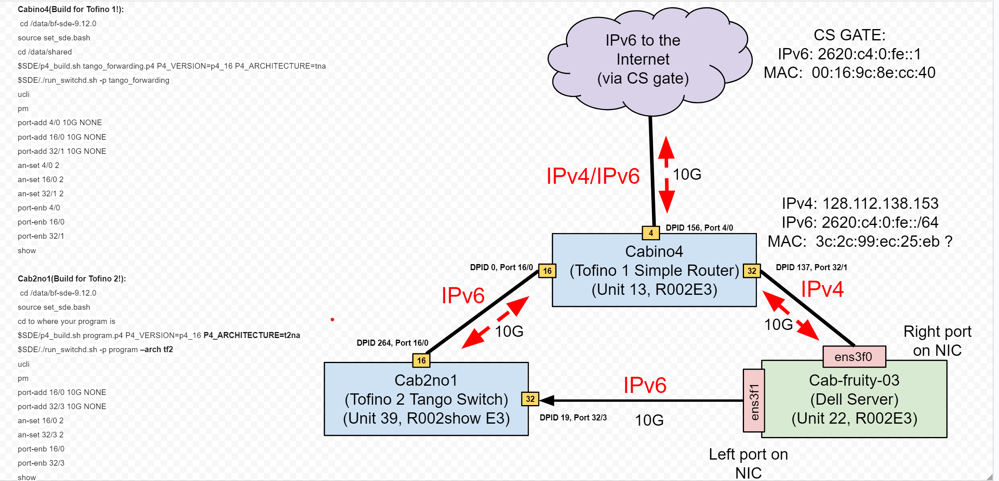

# Dynamic Routing Experiment Overview

## Mini Test for Dynamic Routing with Local eBPF Node in Jen's Testbed

### IP addressing and ip route commands for mini test

To mirror the full interdomain test, the mini test will be with IPv6 internal
packets wrapped in IPv6 external tunnel packets.

The addressing scheme is as follows:
Cabernet802 addressing:
`fc::1 dev enp134s0f0` (global scope)
sends UDP packets to `2604:4540:80::1` (src `fc::1 out dev enp134s0f0`)

Cabino1:
gets packets to `2604:4540:80::1` on Port 16/0 and encapsulates to an address in
`2604:4540:80::/44` and forwards them to Cabernet803

### Cabernet802 (DPID 4, Port 16/0) for sending traffic

Configure routing for interface enp134s0f0 and send traffic with iperf:

```bash
# Set up local IP and MAC 
sudo ifconfig enp134s0f0 <ip6 address> 
sudo ifconfig enp134s0f0 hw ether <mac address> 
# Create route to switch "gateway" with an ipv6 address and the destination MAC of the eBPF server
sudo ip -6 neigh add fc::3 lladdr 50:6b:4b:c4:01:80 dev enp134s0f0
# Add route to destination IPv6 address through switch gateway interface 
sudo ip -6 route add fc::2/128 via fc::3 dev enp134s0f0
# Iperf command to send packets (remove -V for non IPv6 traffic, also remember to adjust destination addresses as needed)
iperf -t 50000000 -i 1 -V -u -c 2604:4540:80::1 -l1000 -b 100k

```

### Cabino1 as Tango switch

```bash
sudo su
cd /data/bf-sde-9.7.1
source set_sde.bash 
cd /u/sy6/tango
$SDE/p4_build.sh tcpv6.p4 P4_VERSION=p4_16 P4_ARCHITECTURE=tna
$SDE/./run_switchd.sh -p tcpv6

# From bfshell> get to bf-sde.pm>, bring up ports for cab802 (16/0) and cab803(15/0), and view sending rates on the ports 
ucli
pm
port-add 16/0 100G NONE
port-add 15/0 100G NONE
an-set 16/0 2
an-set 15/0 2
port-enb 16/0
port-enb 15/0
rate-period 1
rate-show
```

### Cabernet803 (DPID 12, Port 15/0) as eBPF Tango node

```bash
# Use interface enp134s0f0np0 to send and receive traffic 

sudo ifconfig enp134s0f0np0 up 
sudo tcpdump -evvvnX -i enp134s0f0np0
```

## Full Test for Dynamic Routing with external Vultr eBPF Node




### Cabino4 as Simple Forwarding Switch (Remember to Build for Tofino 1!)

```plaintext
Access cabino4 through ssh with public key. Note that the DNS resolution might not be working, so use the IP address (172.17.0.95) directly. 
e.g., ssh soph@172.17.0.95
Install tango_forwarding.p4 program on the P4 switch.
In the P4 switch, send all IPv4 traffic and IPv6 ICMP traffic to/from cab-fruity-03, just 
make it pass through. This will allow cab-fruity-03 to get an IPv4 address from 
the subnet "outside the CS firewall", which will allow you to SSH into it. 
AND cab-fruity-03 will get an IPv6 address too, which can be used to SSH into 
or reach the Internet via IPv6.
Make sure the P4 switch runs the correct program that forwards everything between
the three switch-ports (the switch-port that connects to the CS uplink, the
switch-port that connects to cab-fruity-03, and the switch-port connecting to the Tango switch). 
```


```bash
cd /data/bf-sde-9.12.0
source set_sde.bash
cd /data/shared
$SDE/p4_build.sh tango_forwarding.p4 P4_VERSION=p4_16 P4_ARCHITECTURE=tna
$SDE/./run_switchd.sh -p tango_forwarding
ucli
pm
port-add 4/0 10G NONE
port-add 16/0 10G NONE
port-add 32/1 10G NONE
an-set 4/0 2
an-set 16/0 2
an-set 32/1 2
port-enb 4/0
port-enb 16/0
port-enb 32/1
show 
```

### Cab2no1 as Tango Switch (Remember to Build for Tofino 2!)  
Note, you need to edit the P4 file when compiling to Tofino 2, as the Tofino1 and Tofino2 model have different header lengths (64 bits and 192 bits) for ingress port intrinsic metadata, which can mess up the parsing. Apply the following quick fix for now, until the Lucid compiler is updated. 
```
//In the P4 file, change
pkt.advance(64); --> pkt.advance(PORT_METADATA_SIZE);
//PORT_METADATA_SIZE is a builtin defined in the tna.p4 / t2na.p4 headers
```
To run the program: 
```bash
cd /data/bf-sde-9.12.0
source set_sde.bash
cd to where your program is e.g., /u/soph/tango
$SDE/p4_build.sh tcpv6.p4 P4_VERSION=p4_16 P4_ARCHITECTURE=t2na
$SDE/./run_switchd.sh -p tcpv6 --arch tf2
ucli
pm
port-add 16/0 10G NONE
port-add 32/3 10G NONE
an-set 16/0 2
an-set 32/3 2
port-enb 16/0
port-enb 32/3
show 
```
Also in other terminal populate routes in control plane:
```
cd /data/bf-sde-9.12.0
source set_sde.bash
/data/bf-sde-9.12.0/install/bin/python3.10 /u/birgelee/tango-routing/src/python/edu/princeton/tango/controlplane/init.py
```

To check the populated switch registers in the route_manager table, go to the switch bfshell> command line: 
```
bfshell> bfrt
bfrt> <program_name>
bfrt.program_name> pipe
bfrt.program_name.pipe> route_manager_0
bfrt.program_name.pipe.route_manager_0> dump 

```

Aslo note that in Lucid/P4 the Internet outbound port is 264 and the port where the server is sending traffic which needs to be encapsulated is 19.
### Cab-fruity-03 (DPID X, Port XX/0) for sending traffic

```plaintext
Steps to get access to cab-fruity-03 and notes (from Joon)
----------------------------

cab-fruity-03 is unreachable with regular ssh access because it lost its old 
IPv4 connection because CS staff moved the subnet to "outside of the CS 
firewall". CS staff does not want to make a "bridge" between the inside and 
outside of the CS firewall, so other devices inside the CS firewall (such as 
cab-spicy-02) should not be used to connect to the IPv6 network. The only way 
for cab-fruity-03 to gain access to the IPv4 and IPv6 address is via the P4 
switch or its LOM connection, which is accessible via a web browser if you make 
an SSH tunnel to it.

Note that CS LDAP does not work on this anymore. So we have to create local 
accounts on this machine. I recommend to create a username that is different 
from your CS account name, so that it is easy to move this machine back in to 
the CS firewall when the time comes.

I can create accounts for folks. Let me know your preferred username and SSH 
pub key.
```


### External Vultr eBPF Tango node

## Accessing the Stolkholm Vultr Server 
```
stockholm server: root@65.20.115.127
Make sure to kill ebpf processes to use tcpdump 
/root/performance-aware-routing-2/ebpf/server-module/remove_all.sh

```

## Route Configuration

Currently, we have a set-up for 16 static (keep-alive) routes and two dynamic
(active) routes. They are separated into two groups for testing with two remote
nodes. The route is selected based on the incoming UDP packet's *source port*.
The first group of static routes are mapped from UDP ports [5000, 5007] to
traffic classes [0, 7]. The other static routes are mapped from UDP ports [6000,
6007] to traffic classes [8, 15]. The active routes are UDP port 5008 to traffic
classs 30 and UDP port 6008 to traffic class 31. This is outlined in the
following:

### Static "Keep Alive" Routes

| UDP Source Port | Traffic Class | Path ID   | eBPF Node | IPv6 Destination |
|-----------------|---------------|-----------|-----------|------------------|
| 50000           | 0             | 0         | Stockholm | 2604:4540:88::1  |
| 50001           | 1             | 1         | Stockholm | 2604:4540:89::1  |
| 50002           | 2             | 2         | Stockholm | 2604:4540:8a::1  |
| 50003           | 3             | 3         | Stockholm | 2604:4540:8b::1  |
| 50004           | 4             | 4         | Stockholm | 2604:4540:8c::1  |
| 50005           | 5             | 5         | Stockholm | 2604:4540:8d::1  |
| 50006           | 6             | 6         | Stockholm | 2604:4540:8e::1  |
| 50007           | 7             | 7         | Stockholm | 2604:4540:8f::1  |
| 60000           | 8             | 8         | Stockholm | 2604:4540:88::2  |
| 60001           | 9             | 9         | Stockholm | 2604:4540:89::2  |
| 60002           | 10            | 10        | Stockholm | 2604:4540:8a::2  |
| 60003           | 11            | 11        | Stockholm | 2604:4540:8b::2  |
| 60004           | 12            | 12        | Stockholm | 2604:4540:8c::2  |
| 60005           | 13            | 13        | Stockholm | 2604:4540:8d::2  |
| 60006           | 14            | 14        | Stockholm | 2604:4540:8e::2  |
| 60007           | 15            | 15        | Stockholm | 2604:4540:8f::2  |

### Dynamic "Active" Routes

| UDP Source Port | Traffic Class | Path ID   | eBPF Node |
|-----------------|---------------|-----------|-----------|
| 50008           | 30            | 0         | Stockholm |
| 60008           | 31            | 8         | Stockholm |

### IPv6 Address Conversion

If you need to add a new IPv6 Address to the Lucid program, you must convert it
into two 64-bit integers. There is a provided command in the cli to do this. For
example, given a file with each IPv6 human-readable format on each line,
`addrs.lst`, the following command will convert each field into a
lucid-compatible format and print them to stdout.

```bash
python3.11 -m venv .venv
source .venv/bin/activate
pip install .
tango addrconv --file addrs.lst
deactivate
rm -rf .venv
```

## Triggering Reroutes

There is a custom Route Update packet that the eBPF node can send back to the
switch in order to remap a particular traffic class to a sepcific path
identifier, thereby rerouting the entire class. The packet must be an ICMPv6 Echo Reply (type=129) of the following
form:

```lucid
type RouteUpdate_t = {
   int<<8>> traffic_class;
   int<<8>> new_path_id;
}

event update_route (
    EthernetHeader_t eth_header,
    IPv6Header_t ip_header,
    ICMPHeader_t icmp_header,
    RouteUpdate_t update
)
```

A Scapy program to form these packets with custom layers would look something
akin to the following:

```python
"""Send reroutes to switch."""

from scapy.layers.inet6 import UDP, ByteField, Ether, IPv6, Packet
from scapy.sendrecv import sendp


class RouteUpdate(Packet):
    """Update route layer to trigger reroute on Tango node."""

    name = "TangoUpdateRoute"
    fields_desc = [ByteField("traffic_class", 0), ByteField("new_path_id", 0)]


def main() -> None:
    """Send reroute packets to switch."""
    pkts = [
        Ether()
        / IPv6()
        / ICMPv6EchoReply()
        / RouteUpdate(traffic_class=i, new_path_id=(7 - (i % 8)))
        for i in range(0, 32)
    ]

    sendp(pkts, iface="enp1s0")


if __name__ == "__main__":
    main()
```

A script like the previously described must be run to initialize the static
route mappings upon start-up of the Tofino. In order to execute a script like
this `from Cabertnet802` to `Cabino2`, the following set of commands must be run
on `Cabino2`:

```bash
sudo su
cd /data/bf-sde-9.7.1
source set_sde.bash 
cd /u/bherber/tango-routing
$SDE/p4_build.sh v6.p4 P4_VERSION=p4_16 P4_ARCHITECTURE=tna
$SDE/./run_switchd.sh -p v6
# -- IN BFSHELL --
ucli
pm
port-add 16/0 100G NONE
an-set 16/0 2
port-enb 16/0
rate-period 1
rate-show
```

The following must be run to set-up the ethernet interfaces on `Cabernet802`'s
NIC:

```bash
sudo ifconfig enp134s0f1 fc::2
sudo ifconfig enp134s0f1 hw ether 50:6b:4b:c4:01:91 
sudo ip -6 neigh add fc::3 lladdr 00:90:fb:5e:d6:94 dev enp134s0f1
sudo ip -6 route add fc::2/128 via fc::3 dev enp134s0f1
```
